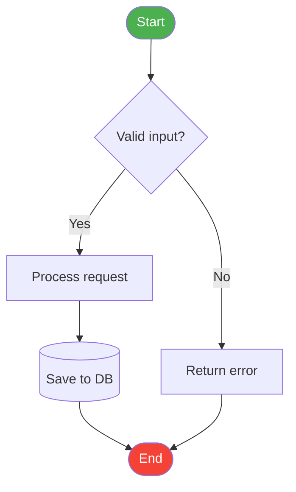

# Diagram Creation

## Quick Reference

| Diagram Type | Best Tool | Guide |
|---|---|---|
| Flowchart / process flow | Mermaid `flowchart` | [mermaid.md](mermaid.md) |
| Sequence diagram | Mermaid `sequenceDiagram` | [mermaid.md](mermaid.md) |
| ER diagram | Mermaid `erDiagram` | [mermaid.md](mermaid.md) |
| Class diagram | Mermaid `classDiagram` | [mermaid.md](mermaid.md) |
| State machine | Mermaid `stateDiagram-v2` | [mermaid.md](mermaid.md) |
| Gantt chart | Mermaid `gantt` | [mermaid.md](mermaid.md) |
| Mind map | Mermaid `mindmap` | [mermaid.md](mermaid.md) |
| Architecture / C4 | Mermaid `architecture-beta` | [mermaid.md](mermaid.md) |
| Large graph (many nodes) | Graphviz DOT | [graphviz.md](graphviz.md) |
| Dependency / call graph | Graphviz DOT | [graphviz.md](graphviz.md) |
| Use case / component / deployment diagram | PlantUML | [plantuml.md](plantuml.md) |
| Complex UML (timing, activity with swimlanes) | PlantUML | [plantuml.md](plantuml.md) |

## Tool Selection

**Use Mermaid** (default) when:
- Output will be embedded in Markdown (GitHub, GitLab, Notion, Obsidian, MkDocs)
- Diagram type is one of the standard supported kinds above
- No build toolchain — paste source at [mermaid.live](https://mermaid.live) for instant preview

**Use PlantUML** when:
- Need diagram types Mermaid doesn't support: use case, component, deployment, activity with swimlanes, timing
- Large class diagrams where PlantUML's layout engine handles relationships better
- User explicitly requests PlantUML

**Use Graphviz DOT** when:
- Graph has many nodes/edges and auto-layout quality is the primary concern
- Dependency graphs, call graphs, tree structures, DAGs
- Need record nodes, HTML-like labels, or port-level edge connections

## Rendering

Save diagram source to a file, then render with the provided script:

```bash
# Mermaid → PNG  (requires: npx)
python scripts/render.py diagram.mmd output.png

# Mermaid → SVG, custom width
python scripts/render.py diagram.mmd output.svg -w 2400

# PlantUML → PNG  (uses online API if plantuml.jar not present)
python scripts/render.py diagram.puml output.png

# Graphviz → PNG  (requires: graphviz installed)
python scripts/render.py diagram.dot output.png

# Graphviz with alternate layout engine
python scripts/render.py diagram.dot output.png -K neato
```

To embed in a DOCX or PPTX, render to PNG first (`-w 1600` minimum), then use the `docx` or `pptx` skill to insert the image.

---

## Getting Started — Mermaid Flowchart

The most common request. Full syntax in [mermaid.md](mermaid.md).



Node shapes: `[rect]` `(rounded)` `([stadium])` `{diamond}` `[(cylinder)]` `((circle))`

Edge types: `-->` `---` `-.->` `==>` `-- label -->`

Direction: `TD` `LR` `BT` `RL`

---

## Design Tips

- **Limit scope**: aim for ≤ 15 nodes per diagram — split large systems into focused sub-diagrams
- **Consistent direction**: pick `LR` or `TD` and stick with it across related diagrams
- **Label edges sparingly**: only when the relationship is ambiguous without a label
- **Match abstraction level**: all nodes in one diagram should sit at the same level

### Color Conventions (Flowcharts)

| Node type | Color |
|---|---|
| Start / End terminal | `#4CAF50` green / `#F44336` red |
| Decision | `#FFF9C4` pale yellow |
| Process step | `#E3F2FD` pale blue |
| External system | `#EEEEEE` light grey |
| Database / storage | `#F3E5F5` pale purple |
| Error / warning path | `#FF9800` orange |
