# Graphviz Reference

Graphviz 是一套开源图形可视化工具，使用 DOT 语言描述图结构，通过多种布局引擎生成有向图、无向图、层次图、网络图等。本文是 diagram skill 的 Graphviz DOT 深度参考文档。

---

## 1. Rendering（渲染）

### 布局引擎说明

| 引擎     | 适用场景                                           | 典型用途                   |
|----------|----------------------------------------------------|----------------------------|
| `dot`    | **有向层次图**，从上到下或从左到右排列             | 流程图、依赖图、树形图     |
| `neato`  | **无向弹簧模型**，节点均匀分散，最小化边交叉       | 网络拓扑、关系图           |
| `fdp`    | **无向力导向**，大规模无向图，比 neato 快          | 社交网络、大型关系图       |
| `sfdp`   | **大规模无向图**，fdp 的多尺度版本，适合超大型图   | 数千节点的依赖图           |
| `twopi`  | **放射状布局**，以某节点为中心向外辐射             | 层次关系、组织架构         |
| `circo`  | **环形布局**，节点排列在圆上                       | 循环依赖、状态机           |
| `osage`  | **集群打包布局**，子图紧密排列                     | 模块化架构                 |
| `patchwork` | **矩形树图**，面积反映权重                      | 代码量分析                 |

### 输出格式

```dot
# 输出 PNG（位图，适合文档嵌入）
dot -Tpng input.dot -o output.png

# 输出 SVG（矢量，适合网页和缩放）
dot -Tsvg input.dot -o output.svg

# 输出 PDF（印刷质量）
dot -Tpdf input.dot -o output.pdf

# 指定布局引擎 + 输出格式
neato -Tsvg input.dot -o output.svg
fdp -Tpng input.dot -o output.png

# 等效写法（-K 参数指定布局引擎）
dot -Kneato -Tsvg input.dot -o output.svg

# 输出多种格式
dot -Tpng -o output.png -Tsvg -o output.svg input.dot
```

### 使用 `scripts/render.py` 渲染

```dot
# 基本用法（默认使用 dot 引擎）
python scripts/render.py input.dot output.png

# 指定布局引擎
python scripts/render.py input.dot output.png -K neato

# 输出 SVG
python scripts/render.py input.dot output.svg -K fdp

# 大型图使用 sfdp
python scripts/render.py input.dot output.svg -K sfdp

# 环形布局
python scripts/render.py input.dot output.png -K circo
```

### 查看可用字体

```dot
# Linux/macOS：列出所有可用字体
fc-list

# 搜索特定字体
fc-list | grep -i "noto"
fc-list | grep -i "mono"

# Windows：查看字体目录
# C:\Windows\Fonts\

# 在 DOT 中使用字体
# fontname="Noto Sans CJK SC"
# fontname="Consolas"
# fontname="Arial"
```

---

## 2. 基础语法

### 有向图 vs 无向图

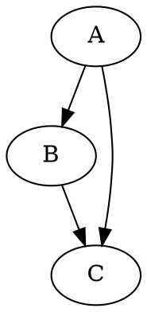

### 注释语法

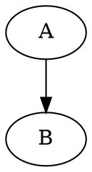

### 全局图属性


---

## 3. 节点（Nodes）

### 内置形状一览

| 形状名称         | 说明                         |
|------------------|------------------------------|
| `box`            | 矩形（默认）                 |
| `ellipse`        | 椭圆（默认 `node` 形状）     |
| `circle`         | 正圆                         |
| `doublecircle`   | 双圆（常用于状态机终态）     |
| `diamond`        | 菱形（决策节点）             |
| `parallelogram`  | 平行四边形                   |
| `trapezium`      | 梯形                         |
| `hexagon`        | 六边形                       |
| `octagon`        | 八边形                       |
| `cylinder`       | 圆柱（数据库）               |
| `Mdiamond`       | 带斜线菱形（UML 特殊节点）   |
| `Msquare`        | 带斜线矩形                   |
| `Mcircle`        | 带斜线圆                     |
| `point`          | 实心点（极小节点）           |
| `none`           | 无边框（仅显示 label）       |
| `plaintext`      | 纯文本（等同 none）          |
| `record`         | Record 节点（用 `|` 分端口）  |
| `Mrecord`        | 圆角 Record 节点             |
| `tab`            | 标签页形状                   |
| `folder`         | 文件夹形状                   |
| `note`           | 便签形状                     |
| `component`      | 组件框（右上角双竖线）       |
| `house`          | 五边形（向上）               |
| `invhouse`       | 五边形（向下）               |
| `star`           | 星形                         |

### 节点属性

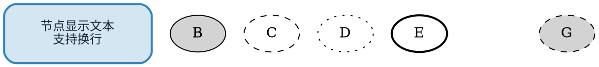

### HTML-like Label

HTML-like label 允许在节点内使用类 HTML 的表格语法，用于创建复杂节点（如 UML 类）：

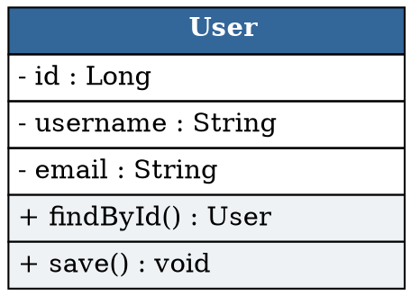

常用 HTML 属性：`BORDER`、`CELLBORDER`、`CELLSPACING`、`CELLPADDING`、`BGCOLOR`、`ALIGN`（LEFT/CENTER/RIGHT）、`COLSPAN`、`ROWSPAN`、`PORT`（用于端口连线）

### Record 节点

Record 节点用 `|` 分割多个区域，用 `<portname>` 定义端口：

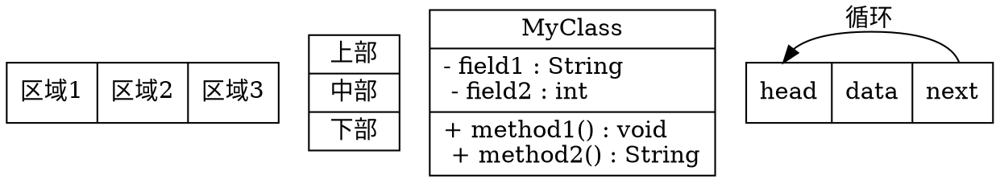

> `\l` = 左对齐换行，`\r` = 右对齐换行，`\n` = 居中换行

---

## 4. 边（Edges）

### 边属性

```dot
digraph G {
    A -> B [
        label     = "边标签"
        color     = "#E74C3C"
        fontcolor = "#E74C3C"
        fontname  = "Arial"
        fontsize  = 10
        style     = dashed       // line（默认）dashed dotted bold invis
        dir       = forward      // forward back both none
        arrowhead = normal       // 终点箭头形状
        arrowtail = none         // 起点箭头形状（dir=back/both 时生效）
        arrowsize = 1.0          // 箭头大小比例
        penwidth  = 2.0          // 线宽
        weight    = 5            // 权重（越大越倾向于短直线，影响布局优先级）
        minlen    = 2            // 最短边长（rank 数量）
        constraint = false       // false = 不影响节点 rank（不参与层级计算）
        headlabel = "端标签"     // 显示在箭头头部附近
        taillabel = "尾标签"     // 显示在箭头尾部附近
        xlabel    = "外部标签"   // 标签显示在边外侧（不干扰布局）
        labeldistance = 2.0      // head/taillabel 距离节点的距离
        labelangle = 25          // head/taillabel 的角度
        decorate  = true         // 连线从标签到边
    ]
}
```

### 箭头形状（arrowhead / arrowtail）

| 类型       | 说明               |
|------------|--------------------|
| `normal`   | 实心三角（默认）   |
| `open`     | 空心三角           |
| `empty`    | 空心三角（同 open）|
| `halfopen` | 半开放箭头         |
| `vee`      | V 形箭头           |
| `box`      | 实心方块           |
| `obox`     | 空心方块           |
| `diamond`  | 实心菱形           |
| `odiamond` | 空心菱形           |
| `dot`      | 实心圆点           |
| `odot`     | 空心圆点           |
| `inv`      | 反向三角           |
| `none`     | 无箭头             |
| `crow`     | 乌鸦脚（多重关系） |
| `tee`      | T 形（禁止）       |
| `curve`    | 曲线               |

可以组合多个箭头：`arrowhead = "odiamond"` 或 `arrowhead = "normalnormal"`（双箭头）

### 端口连接

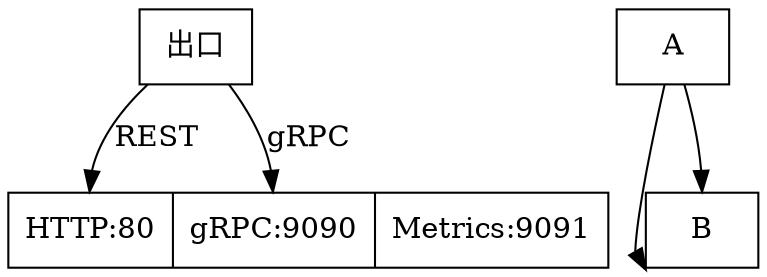

### 边样式完整示例

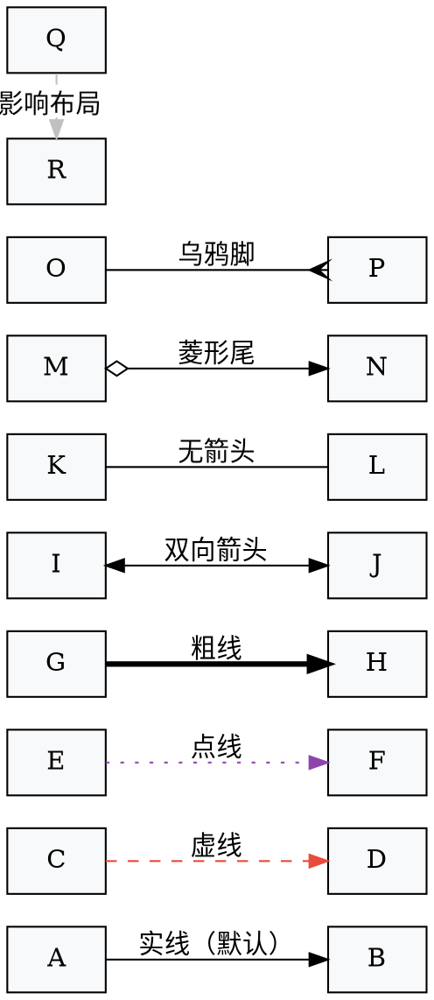

---

## 5. Subgraph & Cluster

### 命名规范

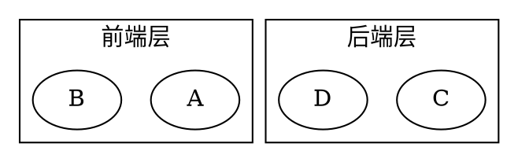

### Cluster 属性

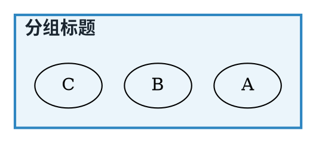

### compound=true + ltail/lhead（Cluster 间连边）

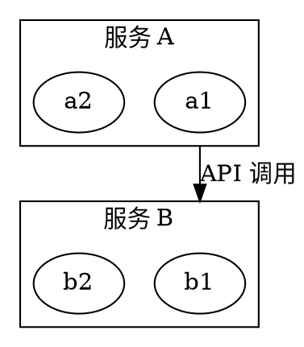

### rank=same（强制同层）

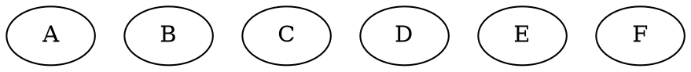

### 完整示例（嵌套 Cluster + Cluster 间连边）

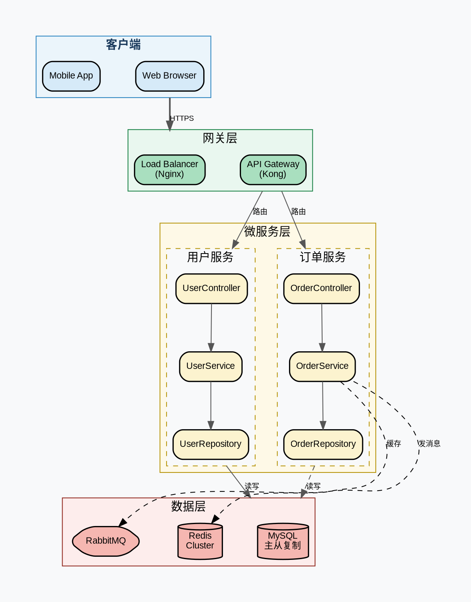

---

## 6. 布局控制

### rankdir（图方向）

```dot
digraph G {
    rankdir = LR   // Left to Right（最常用于流程图）
    // rankdir = TB   // Top to Bottom（默认）
    // rankdir = BT   // Bottom to Top
    // rankdir = RL   // Right to Left
}
```

### nodesep / ranksep（间距控制）

```dot
digraph G {
    graph [
        nodesep = 0.5   // 同层节点之间的最小水平间距（英寸）
        ranksep = 1.0   // 层与层之间的最小间距（英寸）
    ]
}
```

### splines（边路由方式）

| 值          | 说明                               |
|-------------|------------------------------------|
| `spline`    | 贝塞尔曲线（默认，最美观）         |
| `line`      | 直线，可能穿过节点                 |
| `polyline`  | 折线（直角折线，不弯曲）           |
| `curved`    | 曲线（比 spline 更简单）           |
| `ortho`     | 正交折线（水平/垂直，类似 UML 图） |
| `none`      | 不绘制边（仅保留节点布局信息）     |

```dot
digraph G {
    graph [splines = ortho]  // 推荐用于架构图
}
```

### 不可见边技巧（控制排列顺序）

```dot
digraph G {
    rankdir = LR

    // 用不可见边强制 A 在 B 左边
    A -> B [style=invis weight=10]

    // 强制 C 在 D 上方
    C -> D [style=invis]

    // 实际可见的边
    A -> C
    B -> D
}
```

### rank=same 对齐节点

```dot
digraph G {
    rankdir = TB

    // 强制 A B C 在同一层
    { rank = same; A; B; C }

    // 强制 D E 在同一层（且在最底层）
    { rank = sink; D; E }

    // 强制 Start 在最顶层
    { rank = source; Start }

    Start -> A
    Start -> B
    Start -> C
    A -> D
    B -> D
    C -> E
}
```

### 完整布局控制示例

```dot
digraph LayoutDemo {
    graph [
        rankdir  = LR
        nodesep  = 0.4
        ranksep  = 0.8
        splines  = ortho
        bgcolor  = "#FAFAFA"
        pad      = 0.4
        fontname = "Arial"
    ]
    node [
        shape    = box
        style    = "filled,rounded"
        fillcolor = "#FFFFFF"
        fontname = "Arial"
        fontsize = 11
        penwidth = 1.5
        margin   = "0.15,0.1"
    ]
    edge [
        color    = "#888888"
        fontname = "Arial"
        fontsize = 9
    ]

    // 强制最左列
    { rank = source; 需求 }

    // 强制最右列
    { rank = sink; 上线 }

    // 中间同层对齐
    { rank = same; 前端开发; 后端开发; 测试 }
    { rank = same; 代码审查; 集成测试 }

    需求 -> 前端开发 [label="UI 设计"]
    需求 -> 后端开发 [label="API 设计"]
    需求 -> 测试     [label="测试计划" style=dashed]

    前端开发 -> 代码审查
    后端开发 -> 代码审查

    代码审查 -> 集成测试
    测试 -> 集成测试 [constraint=false]

    集成测试 -> 上线 [label="发布" penwidth=2 color="#27AE60"]

    // 不可见边控制前端在后端上面
    前端开发 -> 后端开发 [style=invis]
    后端开发 -> 测试     [style=invis]
}
```

---

## 7. 颜色

### X11 颜色名称（常用）

| 颜色名          | 色值        | 预览说明   |
|-----------------|-------------|------------|
| `white`         | `#FFFFFF`   | 白色       |
| `black`         | `#000000`   | 黑色       |
| `gray`          | `#BEBEBE`   | 灰色       |
| `lightgray`     | `#D3D3D3`   | 浅灰       |
| `red`           | `#FF0000`   | 红色       |
| `green`         | `#008000`   | 绿色       |
| `blue`          | `#0000FF`   | 蓝色       |
| `yellow`        | `#FFFF00`   | 黄色       |
| `orange`        | `#FFA500`   | 橙色       |
| `purple`        | `#800080`   | 紫色       |
| `cyan`          | `#00FFFF`   | 青色       |
| `magenta`       | `#FF00FF`   | 洋红       |
| `gold`          | `#FFD700`   | 金色       |
| `navy`          | `#000080`   | 深蓝       |
| `coral`         | `#FF7F50`   | 珊瑚红     |
| `tomato`        | `#FF6347`   | 番茄红     |
| `skyblue`       | `#87CEEB`   | 天蓝       |
| `lightblue`     | `#ADD8E6`   | 浅蓝       |
| `lightgreen`    | `#90EE90`   | 浅绿       |
| `lightyellow`   | `#FFFFE0`   | 浅黄       |

### 十六进制 RGB 和 RGBA

```dot
digraph G {
    // 十六进制 RGB（最常用）
    A [fillcolor="#3498DB" style=filled]

    // 十六进制 RGBA（第 4 组为透明度 00=完全透明 FF=完全不透明）
    B [fillcolor="#3498DBAA" style=filled]  // 约 67% 不透明

    // HSV 颜色（色相/饱和度/亮度，均为 0-1 的浮点数）
    C [fillcolor="0.6 0.8 0.9" style=filled]
}
```

### 渐变 fillcolor

```dot
digraph G {
    // 双色渐变（使用冒号分隔）
    A [
        fillcolor = "#3498DB:#2ECC71"
        style     = filled
        gradientangle = 270   // 渐变角度（0=水平 270=垂直从上到下）
    ]

    // 三色渐变（中间色需指定位置比例）
    B [
        fillcolor = "#E74C3C:0.3:#F39C12:0.7:#F1C40F"
        style     = filled
        gradientangle = 0
    ]

    // 节点颜色（边框）和填充色分离
    C [
        color     = "#2C3E50"   // 边框色
        fillcolor = "#ECF0F1"   // 填充色
        style     = filled
        penwidth  = 2
    ]
}
```

---

## 8. 典型用例示例

### CI/CD Pipeline

```dot
digraph CICD {
    rankdir  = LR
    graph [bgcolor="#F8F9FA" pad=0.4 nodesep=0.3 ranksep=0.6 splines=ortho]
    node [fontname="Arial" fontsize=11 style="filled,rounded" penwidth=1.5]
    edge [fontname="Arial" fontsize=9 color="#555"]

    // 阶段颜色定义（通过节点颜色区分）
    node [fillcolor="#D6EAF8" color="#2874A6"] // 蓝色：源码
    Code    [label="📝 代码提交\n(Git Push)"]
    PR      [label="🔀 Pull Request\n审查"]

    node [fillcolor="#D5F5E3" color="#1E8449"] // 绿色：CI
    Lint    [label="🔍 代码静态\n分析 (ESLint)"]
    Test    [label="✅ 单元测试\n(Jest)"]
    Build   [label="🏗️ 构建镜像\n(Docker Build)"]
    Push    [label="📦 推送镜像\n(Registry)"]

    node [fillcolor="#FEF9E7" color="#B7950B"] // 黄色：预发
    Staging [label="🚀 部署 Staging"]
    E2E     [label="🤖 E2E 测试\n(Playwright)"]
    Approve [label="👤 人工审批"]

    node [fillcolor="#FDEDEC" color="#922B21"] // 红色：生产
    Prod    [label="🌐 生产部署\n(Blue/Green)"]
    Health  [label="❤️ 健康检查"]
    Done    [label="✅ 发布完成" shape=doublecircle fillcolor="#A9DFBF" color="#1E8449"]

    // 源码阶段
    { rank = same; Code; PR }
    Code -> PR [label="触发"]

    // CI 阶段
    { rank = same; Lint; Test }
    PR -> Lint  [label="CI 触发"]
    PR -> Test  [label="并行"]
    Lint -> Build
    Test -> Build
    Build -> Push

    // 预发阶段
    Push -> Staging -> E2E -> Approve

    // 生产阶段
    Approve -> Prod -> Health -> Done

    // 失败路径
    node [fillcolor="#FADBD8" color="#922B21"]
    Fail [label="❌ 失败通知\n(Slack/Email)" shape=diamond]

    E2E -> Fail [label="测试失败" style=dashed color="#E74C3C"]
    Health -> Fail [label="健康检查失败" style=dashed color="#E74C3C"]
    Fail -> Code [label="修复后重试" style=dashed color="#E74C3C" constraint=false]
}
```

### 系统架构图（含 Cluster 和 Compound 边）

```dot
digraph SystemArch {
    compound  = true
    rankdir   = TB
    graph [bgcolor="#F5F5F5" pad=0.5 nodesep=0.5 ranksep=0.7 splines=ortho fontname="Arial"]
    node [shape=box style="filled,rounded" fontname="Arial" fontsize=10 penwidth=1.5]
    edge [fontname="Arial" fontsize=9]

    // 用户端
    subgraph cluster_users {
        label="用户端" style=filled fillcolor="#E8F4FD" color="#2980B9" fontname="Arial Bold"
        web    [label="Web\nBrowser"  fillcolor="#AED6F1"]
        mobile [label="Mobile\nApp"   fillcolor="#AED6F1"]
        iot    [label="IoT\nDevice"   fillcolor="#AED6F1"]
    }

    // CDN
    cdn [label="CDN\n(CloudFront)" shape=hexagon style=filled fillcolor="#FAD7A0" color="#E67E22"]

    // 接入层
    subgraph cluster_ingress {
        label="接入层" style=filled fillcolor="#E9F7EF" color="#27AE60" fontname="Arial Bold"
        waf  [label="WAF\n防火墙"    fillcolor="#A9DFBF"]
        slb  [label="SLB\n负载均衡" fillcolor="#A9DFBF"]
    }

    // 应用层
    subgraph cluster_app {
        label="应用层" style=filled fillcolor="#FEF9E7" color="#D4AC0D" fontname="Arial Bold"
        api_gw  [label="API Gateway" fillcolor="#FAD7A0"]
        auth    [label="Auth Service" fillcolor="#FAD7A0"]
        user    [label="User Service" fillcolor="#FAD7A0"]
        order   [label="Order Service" fillcolor="#FAD7A0"]
        product [label="Product Service" fillcolor="#FAD7A0"]
    }

    // 数据层
    subgraph cluster_data {
        label="数据层" style=filled fillcolor="#FDEDEC" color="#C0392B" fontname="Arial Bold"
        mysql  [label="MySQL\n主库"   shape=cylinder fillcolor="#F1948A"]
        slave  [label="MySQL\n从库"   shape=cylinder fillcolor="#F1948A"]
        redis  [label="Redis\nCluster" shape=cylinder fillcolor="#F1948A"]
        es     [label="Elasticsearch" shape=cylinder fillcolor="#F1948A"]
        mq     [label="Kafka\nMQ"    shape=hexagon  fillcolor="#F1948A"]
    }

    // 连线
    web    -> cdn [ltail=cluster_users]
    mobile -> cdn [ltail=cluster_users style=invis]
    cdn -> waf
    waf -> slb
    slb -> api_gw [lhead=cluster_app]
    api_gw -> auth
    api_gw -> user
    api_gw -> order
    api_gw -> product

    user    -> mysql  [ltail=cluster_app lhead=cluster_data label="读写"]
    order   -> mysql  [ltail=cluster_app lhead=cluster_data style=invis]
    mysql   -> slave  [label="主从同步" style=dashed]
    user    -> redis  [ltail=cluster_app constraint=false label="缓存"]
    order   -> mq     [ltail=cluster_app constraint=false label="发布事件"]
    product -> es     [ltail=cluster_app constraint=false label="索引"]
}
```

### 类依赖图（sfdp 布局，大量节点）

```dot
digraph ClassDependencies {
    // 使用 sfdp 或 fdp 处理大规模图
    // 渲染命令：sfdp -Tsvg -Goverlap=prism input.dot -o output.svg
    graph [
        overlap  = prism    // 减少节点重叠（sfdp 专用）
        splines  = curved
        bgcolor  = "#FAFAFA"
        K        = 0.8      // sfdp 弹簧系数（越小越紧凑）
        fontname = "Arial"
    ]
    node [
        shape    = box
        style    = "filled,rounded"
        fontname = "Arial"
        fontsize = 9
        penwidth = 1
        margin   = "0.1,0.05"
    ]
    edge [color="#CCCCCC" arrowsize=0.6]

    // Controller 层（蓝色）
    node [fillcolor="#D6EAF8" color="#2874A6"]
    UserCtrl    [label="UserController"]
    OrderCtrl   [label="OrderController"]
    ProductCtrl [label="ProductController"]
    AuthCtrl    [label="AuthController"]

    // Service 层（绿色）
    node [fillcolor="#D5F5E3" color="#1E8449"]
    UserSvc     [label="UserService"]
    OrderSvc    [label="OrderService"]
    ProductSvc  [label="ProductService"]
    AuthSvc     [label="AuthService"]
    PaymentSvc  [label="PaymentService"]
    NotifySvc   [label="NotificationService"]

    // Repository 层（橙色）
    node [fillcolor="#FEF9E7" color="#B7950B"]
    UserRepo    [label="UserRepository"]
    OrderRepo   [label="OrderRepository"]
    ProductRepo [label="ProductRepository"]
    TokenRepo   [label="TokenRepository"]

    // 工具类（灰色）
    node [fillcolor="#F2F3F4" color="#7F8C8D"]
    JwtUtil     [label="JwtUtil"]
    CacheUtil   [label="CacheUtil"]
    MQUtil      [label="MQUtil"]

    // 依赖关系
    UserCtrl    -> UserSvc
    OrderCtrl   -> OrderSvc
    ProductCtrl -> ProductSvc
    AuthCtrl    -> AuthSvc

    UserSvc     -> UserRepo
    UserSvc     -> CacheUtil
    OrderSvc    -> OrderRepo
    OrderSvc    -> UserSvc
    OrderSvc    -> ProductSvc
    OrderSvc    -> PaymentSvc
    OrderSvc    -> NotifySvc
    OrderSvc    -> MQUtil
    ProductSvc  -> ProductRepo
    ProductSvc  -> CacheUtil
    AuthSvc     -> UserSvc
    AuthSvc     -> TokenRepo
    AuthSvc     -> JwtUtil
    PaymentSvc  -> MQUtil
    NotifySvc   -> MQUtil
}
```

### 状态机（双圆终态，edge 方向）

```dot
digraph OrderStateMachine {
    rankdir = LR
    graph [bgcolor="#FAFAFA" pad=0.4 nodesep=0.6 ranksep=0.8 fontname="Arial"]
    node [fontname="Arial" fontsize=11 penwidth=1.5]
    edge [fontname="Arial" fontsize=9 color="#555555"]

    // 初始状态（实心圆）
    init [label="" shape=circle style=filled fillcolor=black width=0.3 height=0.3]

    // 普通状态（圆角矩形）
    node [shape=box style="filled,rounded"]

    node [fillcolor="#D6EAF8" color="#2874A6"]
    Draft   [label="草稿\nDraft"]

    node [fillcolor="#FEF9E7" color="#B7950B"]
    Pending [label="待支付\nPending"]

    node [fillcolor="#D5F5E3" color="#1E8449"]
    Paid    [label="已支付\nPaid"]
    Shipped [label="已发货\nShipped"]

    node [fillcolor="#A9DFBF" color="#1E8449"]
    Done    [label="已完成\nCompleted"]

    node [fillcolor="#FADBD8" color="#922B21"]
    Cancelled [label="已取消\nCancelled"]
    Refunded  [label="已退款\nRefunded"]

    // 终态（双圆）
    final [label="" shape=doublecircle style=filled fillcolor=black width=0.3 height=0.3]

    // 转换
    init      -> Draft    [label="创建订单"]
    Draft     -> Pending  [label="提交"]
    Draft     -> Cancelled [label="放弃"]
    Pending   -> Paid     [label="支付成功" color="#1E8449" penwidth=2]
    Pending   -> Cancelled [label="超时/取消" color="#E74C3C" style=dashed]
    Paid      -> Shipped  [label="发货"]
    Shipped   -> Done     [label="签收确认" color="#1E8449" penwidth=2]
    Done      -> Refunded [label="申请退货\n[7天内]" style=dashed]
    Refunded  -> final    [label="完成"]
    Done      -> final    [label="评价后"]
    Cancelled -> final    [label="结束"]

    // 自循环（支付重试）
    Pending -> Pending [label="支付失败\n重试" style=dashed color="#E67E22"]
}
```

---

## 9. 与 Mermaid 对比

### 语法对比（同一张流程图）

| 特性                 | Mermaid flowchart                     | Graphviz DOT                         |
|----------------------|---------------------------------------|--------------------------------------|
| **图声明**           | `flowchart LR`                        | `digraph G { rankdir=LR ... }`       |
| **节点（默认矩形）** | `A[节点文本]`                         | `A [label="节点文本"]`               |
| **节点（圆形）**     | `A((文本))`                           | `A [shape=circle]`                   |
| **节点（菱形）**     | `A{文本}`                             | `A [shape=diamond]`                  |
| **有向边**           | `A --> B`                             | `A -> B`                             |
| **带标签的边**       | `A -->|标签| B`                       | `A -> B [label="标签"]`              |
| **虚线边**           | `A -.-> B`                            | `A -> B [style=dashed]`              |
| **无向边**           | 不支持（flowchart 全为有向）          | `graph G { A -- B }`                 |
| **子图/分组**        | `subgraph 名称 ... end`               | `subgraph cluster_xxx { ... }`       |
| **颜色样式**         | `style A fill:#color,stroke:#color`   | `A [fillcolor="#color" style=filled]`|
| **链接**             | `A --> B --> C`（链式）               | 必须每行单独写                       |
| **注释**             | `%% 注释`                             | `// 注释` 或 `/* 注释 */`            |
| **图方向**           | `flowchart LR/TD/BT/RL`              | `rankdir = LR/TB/BT/RL`             |
| **渲染方式**         | 浏览器 JS / GitHub 原生               | 本地命令行 / 服务端                  |
| **HTML label**       | 不支持                                | 支持（`<TABLE>` 语法）               |
| **端口连线**         | 不支持                                | 支持（`node:port`）                  |
| **多布局引擎**       | 不支持（固定算法）                    | 支持（dot/neato/fdp/sfdp 等）        |

**同一张图的等价代码：**

Mermaid 写法：

```F:\supermarket\skills\diagram\graphviz.md#L1-1
flowchart LR
    A[用户请求] --> B{认证通过?}
    B -->|是| C[处理请求]
    B -->|否| D[返回 401]
    C --> E[返回响应]
```

Graphviz DOT 写法：

```dot
digraph G {
    rankdir = LR
    node [shape=box style="filled,rounded" fillcolor="#F8F9FA"]

    A [label="用户请求"]
    B [label="认证通过?" shape=diamond fillcolor="#FEF9E7"]
    C [label="处理请求"]
    D [label="返回 401" fillcolor="#FADBD8"]
    E [label="返回响应" fillcolor="#D5F5E3"]

    A -> B
    B -> C [label="是"]
    B -> D [label="否"]
    C -> E
}
```

### 什么情况必须用 Graphviz

| 场景                               | 原因                                              |
|------------------------------------|---------------------------------------------------|
| **节点数 > 20**                    | sfdp/fdp 自动布局，Mermaid 大图布局混乱           |
| **需要 HTML-like label**           | UML 类图、表格节点、多颜色区域，Mermaid 不支持    |
| **需要端口精确连线**               | Record/HTML 节点的 `node:port` 语法，数据流图必备 |
| **需要 compound 边（cluster 间）** | 微服务架构图、系统边界连线，Mermaid 无法实现      |
| **需要精细布局控制**               | `rank=same`、不可见边、`weight` 优先级，Mermaid 不提供 |
| **非层次图（网状/圆形）**          | neato/circo/twopi 布局，Mermaid 只有层次流程图    |
| **需要 PDF/EPS 高精度输出**        | 生产印刷、大型海报，需要矢量格式                  |
| **渐变色/高级样式**                | gradientangle、RGBA 透明度，Mermaid 样式有限      |
| **需要批量自动化生成**             | 命令行管道、脚本生成，dot 命令适合 CI/CD 集成     |
| **自环边 / 多重边**                | 复杂状态机，Mermaid 对自环支持较弱                |

**选 Mermaid 的场景**：GitHub/GitLab Markdown 内嵌（原生渲染）、简单流程图、甘特图、饼图、团队快速沟通草图。
