# Mermaid Reference

Mermaid is a JavaScript-based diagramming and charting tool that renders text definitions into diagrams.
This document is a deep reference for AI assistants generating Mermaid diagrams.

---

## Table of Contents

1. [Flowchart](#1-flowchart)
2. [Sequence Diagram](#2-sequence-diagram)
3. [ER Diagram](#3-er-diagram)
4. [Class Diagram](#4-class-diagram)
5. [State Diagram](#5-state-diagram-statediagram-v2)
6. [Gantt Chart](#6-gantt-chart)
7. [Mind Map](#7-mind-map)
8. [Architecture Diagram](#8-architecture-diagram)
9. [Other Chart Types](#9-other-chart-types)
10. [Theming & Styling](#10-theming--styling)
11. [Common Pitfalls](#11-common-pitfalls)

---

## 1. Flowchart

Keyword: `flowchart` (preferred) or `graph`.

### 1.1 Directions

| Code | Meaning               |
|------|-----------------------|
| `TD` | Top → Down (default)  |
| `TB` | Top → Bottom (= TD)   |
| `LR` | Left → Right          |
| `RL` | Right → Left          |
| `BT` | Bottom → Top          |

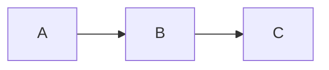

### 1.2 Node Shapes

| Shape        | Syntax                   | Renders as              |
|--------------|--------------------------|-------------------------|
| Rectangle    | `id[Label]`              | Square-cornered box     |
| Rounded      | `id(Label)`              | Rounded-corner box      |
| Stadium      | `id([Label])`            | Pill / stadium          |
| Subroutine   | `id[[Label]]`            | Double-sided rectangle  |
| Cylinder      | `id[(Label)]`            | Database cylinder       |
| Circle       | `id((Label))`            | Circle                  |
| Asymmetric   | `id>Label]`              | Flag / ribbon shape     |
| Diamond      | `id{Label}`              | Decision diamond        |
| Hexagon      | `id{{Label}}`            | Hexagon                 |
| Parallelogram | `id[/Label/]`           | Parallelogram           |
| Parallelogram Alt | `id[\Label\]`       | Reversed parallelogram  |
| Trapezoid    | `id[/Label\]`            | Trapezoid               |
| Trapezoid Alt | `id[\Label/]`           | Inverted trapezoid      |

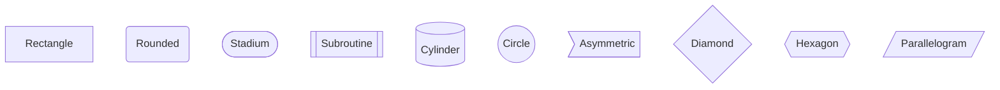

### 1.3 Edge (Link) Types

| Type                  | Syntax          | Description                     |
|-----------------------|-----------------|---------------------------------|
| Arrow                 | `A --> B`       | Solid line with arrowhead       |
| Open line             | `A --- B`       | Solid line, no arrow            |
| Dashed arrow          | `A -.-> B`      | Dashed line with arrow          |
| Dashed line           | `A -.- B`       | Dashed line, no arrow           |
| Thick arrow           | `A ==> B`       | Thick line with arrow           |
| Thick line            | `A === B`       | Thick line, no arrow            |
| Labeled arrow         | `A -->|label| B`| Arrow with inline label         |
| Labeled dashed        | `A -.->|label| B`| Dashed arrow with label        |
| Dotted no-arrow       | `A ~~~  B`      | Invisible link (layout hint)    |
| Circle edge           | `A --o B`       | Line ending with circle         |
| Cross edge            | `A --x B`       | Line ending with cross          |
| Bidirectional arrow   | `A <--> B`      | Double arrowhead                |

**Label alternatives:**

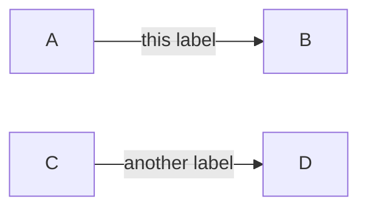

### 1.4 Subgraph

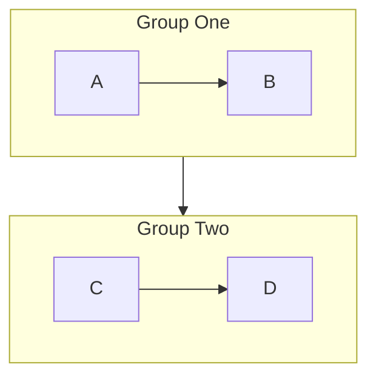

- Subgraphs can have their own direction: `subgraph id [title]\n  direction LR\n  ...`
- Subgraph IDs must not clash with node IDs.
- Nodes inside subgraphs can connect to nodes outside.

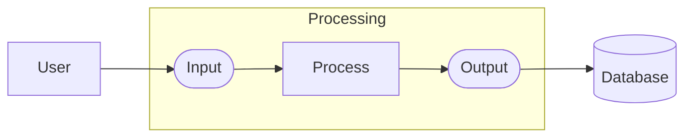

### 1.5 Complete Flowchart Example

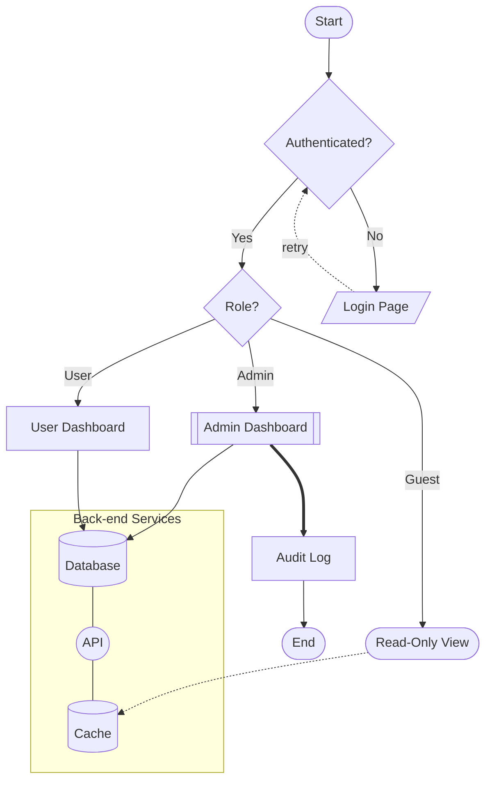

---

## 2. Sequence Diagram

Keyword: `sequenceDiagram`

### 2.1 Participants and Actors

| Syntax                    | Renders as               |
|---------------------------|--------------------------|
| `participant Alice`       | Rectangle box            |
| `actor Bob`               | Stick-figure (person)    |
| `participant A as Alice`  | Box labeled "Alice", referred to as `A` |
| `actor B as Bob`          | Actor with alias         |

Participants declared at the top appear in left-to-right order.
Undeclared participants are auto-created in order of first use.

### 2.2 Arrow / Message Types

| Syntax      | Line   | Arrowhead | Description                        |
|-------------|--------|-----------|------------------------------------|
| `A->>B`     | Solid  | Open      | Synchronous call (most common)     |
| `A-->>B`    | Dashed | Open      | Asynchronous / return reply        |
| `A->B`      | Solid  | Open thin | Thin solid (less common)           |
| `A-->B`     | Dashed | Open thin | Thin dashed                        |
| `A-xB`      | Solid  | Cross (×) | Lost / rejected message            |
| `A--xB`     | Dashed | Cross (×) | Async lost message                 |
| `A-)B`      | Solid  | Open ring | Async with open ring head          |
| `A--)B`     | Dashed | Open ring | Async return with open ring        |

Add a label after the colon: `A->>B: message text`

### 2.3 Activation Bars

```
activate Alice
  Alice->>Bob: request
  Bob-->>Alice: response
deactivate Alice
```

Shorthand — append `+` / `-` to the arrow line:

```
Alice->>+Bob: request
Bob-->>-Alice: response
```

Nested activations are supported by repeating `+`:

```
Alice->>+Bob: outer call
Bob->>+Bob: self-call
Bob-->>-Bob: return
Bob-->>-Alice: final return
```

### 2.4 Control Blocks

```
alt condition text
    A->>B: message
else other condition
    A->>C: message
end

opt optional block
    A->>B: maybe happens
end

loop Every minute
    A->>B: heartbeat
end

par Parallel block
    A->>B: send
and
    A->>C: notify
end

critical Required section
    A->>B: critical call
option fallback
    A->>C: fallback call
end

break on error
    A->>A: log error
end
```

### 2.5 Notes

```
Note right of Alice: This is a note
Note left of Bob: Another note
Note over Alice,Bob: Spanning note
```

### 2.6 autonumber

Place `autonumber` at the top (before participants) to auto-number all messages.

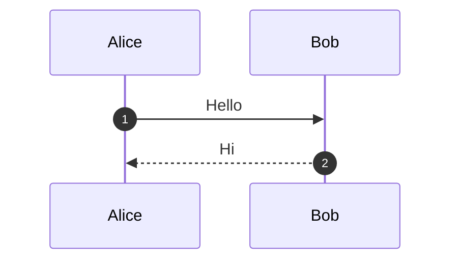

### 2.7 Complete Sequence Diagram Example

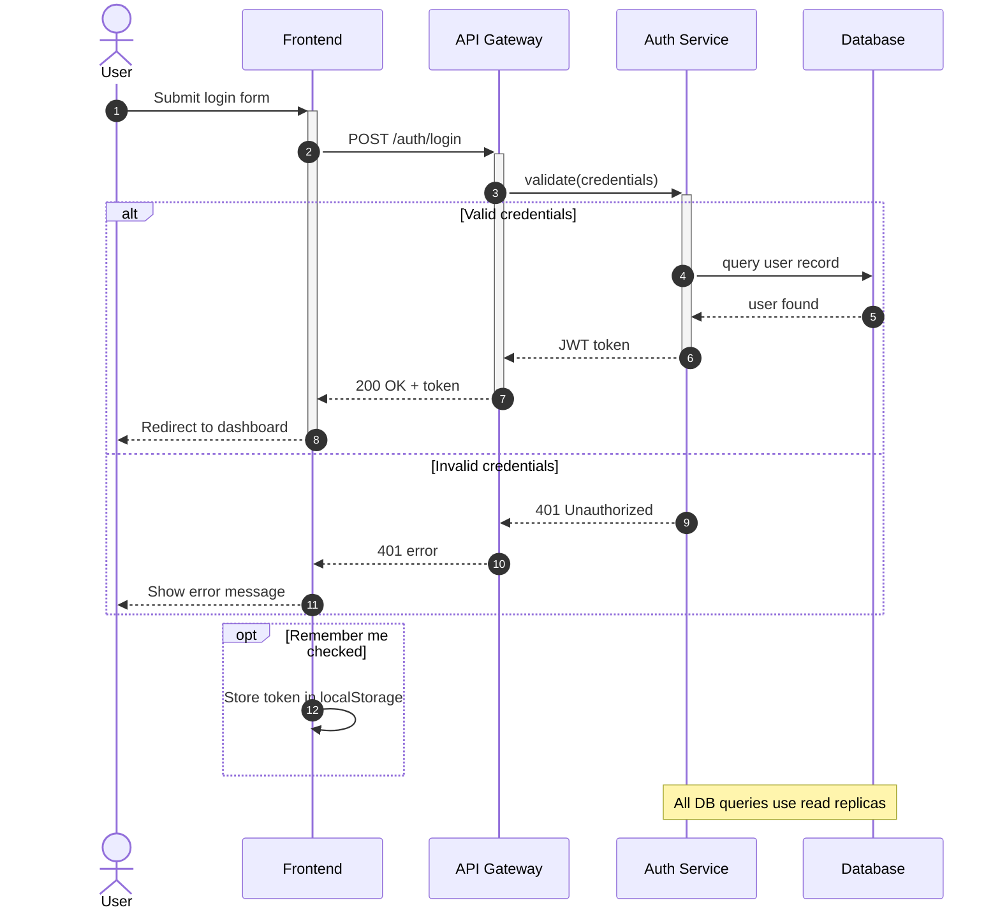

---

## 3. ER Diagram

Keyword: `erDiagram`

### 3.1 Entity and Attribute Syntax

```
erDiagram
    ENTITY_NAME {
        type  attributeName  PK
        type  attributeName  FK
        type  attributeName  UK
        type  attributeName
    }
```

**Attribute modifiers (keys):**

| Modifier | Meaning          |
|----------|------------------|
| `PK`     | Primary Key      |
| `FK`     | Foreign Key      |
| `UK`     | Unique Key       |

### 3.2 Legal Attribute Types

The type field is a single word (no spaces). Common conventions:

| Type       | Description           |
|------------|-----------------------|
| `string`   | Text / varchar        |
| `int`      | Integer               |
| `float`    | Floating point        |
| `boolean`  | True / false          |
| `date`     | Calendar date         |
| `datetime` | Date with time        |
| `bigint`   | Large integer         |
| `uuid`     | UUID identifier       |
| `enum`     | Enumeration           |

> **Important:** Mermaid ER attribute types are purely cosmetic labels — the parser accepts almost any single token. However, types with spaces (e.g., `varchar(255)`) must be avoided or quoted; prefer `string` instead.

### 3.3 Cardinality Symbols

Cardinality is written on both sides of the relationship line: `LEFT_ENTITY CARDINALITY--CARDINALITY RIGHT_ENTITY : "label"`

| Symbol | Meaning              |
|--------|----------------------|
| `\|\|`  | Exactly one          |
| `o\|`   | Zero or one          |
| `\|{`   | One or more          |
| `o{`    | Zero or more         |

Combined examples:

| Notation          | Meaning                          |
|-------------------|----------------------------------|
| `\|\|--\|\|`       | One-to-one (both mandatory)      |
| `\|\|--o\|`        | One-to-zero-or-one               |
| `\|\|--o{`         | One-to-many (right optional)     |
| `\|\|--\|{`        | One-to-many (right mandatory)    |
| `o{--o{`          | Many-to-many (both optional)     |

Relationship verbs (the label after `:`) are quoted strings. Use `"` around multi-word labels.

### 3.4 Complete ER Diagram Example

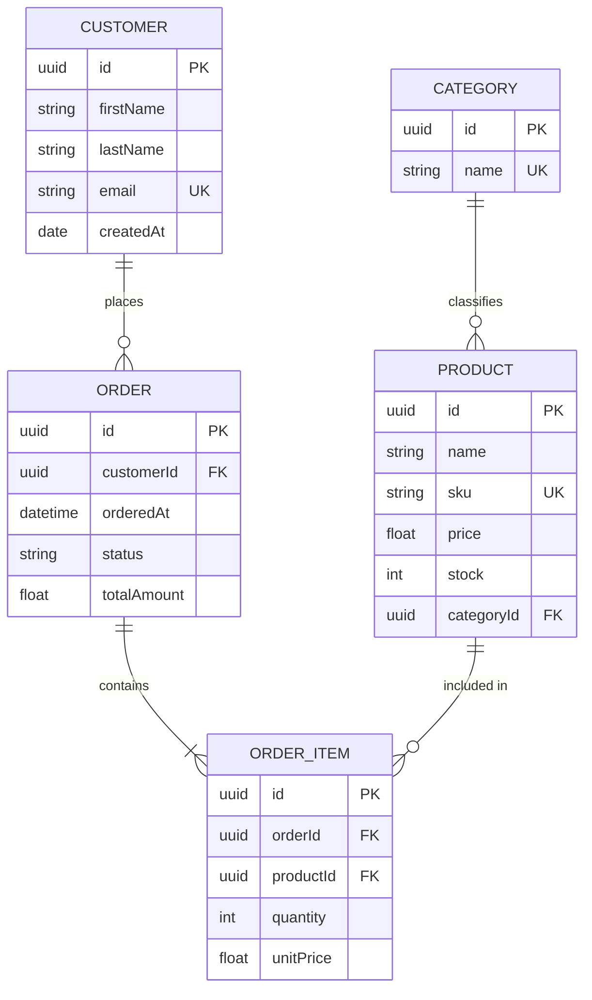

---

## 4. Class Diagram

Keyword: `classDiagram`

### 4.1 Class Definition Syntax

```
classDiagram
    class ClassName {
        +publicField : Type
        -privateField : Type
        #protectedField : Type
        ~packageField : Type
        +publicMethod(param : Type) ReturnType
        -privateMethod() void
    }
```

**Visibility modifiers:**

| Symbol | Visibility  |
|--------|-------------|
| `+`    | Public      |
| `-`    | Private     |
| `#`    | Protected   |
| `~`    | Package     |

**Static and abstract:**

- Static: append `$` → `+staticMethod()$`
- Abstract: append `*` → `+abstractMethod()*`

### 4.2 Relationship Arrows

| Syntax           | Arrow            | Relationship   | Description                          |
|------------------|------------------|----------------|--------------------------------------|
| `A <\|-- B`       | Solid + triangle | Inheritance    | B extends A                          |
| `A <\|.. B`       | Dashed + triangle| Realization    | B implements interface A             |
| `A *-- B`        | Solid + diamond  | Composition    | B is part of A (strong ownership)    |
| `A o-- B`        | Solid + open diamond | Aggregation | B belongs to A (weak ownership)     |
| `A --> B`        | Solid + arrow    | Association    | A uses / references B                |
| `A -- B`         | Solid line       | Link           | Undirected association               |
| `A ..> B`        | Dashed + arrow   | Dependency     | A depends on B                       |
| `A .. B`         | Dashed line      | Realization    | Generic dashed link                  |

**Adding labels and cardinality to relationships:**

```
Customer "1" --> "0..*" Order : places
```

### 4.3 Generics

Use `~T~` for type parameters:

```
classDiagram
    class Repository~T~ {
        +findById(id : int) T
        +findAll() List~T~
        +save(entity : T) T
    }
```

### 4.4 Annotations (Stereotypes)

Place on a separate line after the class definition:

```
classDiagram
    class IRepository {
        <<Interface>>
        +findById(id : int)
    }
    class AbstractService {
        <<Abstract>>
        +process()* void
    }
    class DataTransferObject {
        <<DTO>>
    }
    class AppConfig {
        <<Singleton>>
    }
    class OrderFactory {
        <<Factory>>
    }
```

### 4.5 Notes

```
note for ClassName "This is a note about the class"
```

### 4.6 Complete Class Diagram Example

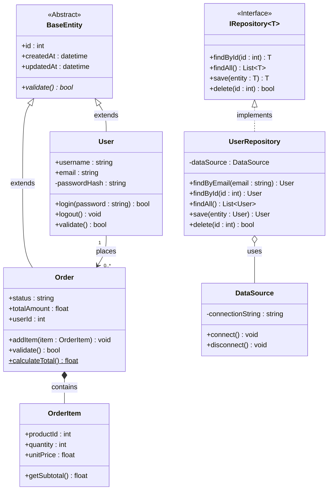

---

## 5. State Diagram (stateDiagram-v2)

Keyword: `stateDiagram-v2` (always prefer v2 over the deprecated `stateDiagram`)

### 5.1 Basic Transitions

```
stateDiagram-v2
    [*] --> StateA
    StateA --> StateB : event / action
    StateB --> [*]
```

- `[*]` is the start (and end) pseudostate.
- Labels on transitions follow `:`.

### 5.2 Composite (Nested) States

```
stateDiagram-v2
    state Processing {
        [*] --> Validating
        Validating --> Executing
        Executing --> [*]
    }
    [*] --> Processing
    Processing --> Done
```

### 5.3 Fork and Join

```
stateDiagram-v2
    state fork_state <<fork>>
    state join_state <<join>>

    [*]         --> fork_state
    fork_state  --> BranchA
    fork_state  --> BranchB
    BranchA     --> join_state
    BranchB     --> join_state
    join_state  --> [*]
```

### 5.4 Concurrency (Parallel Regions)

Use `--` to divide a composite state into parallel regions:

```
stateDiagram-v2
    state Concurrent {
        [*] --> RegionA
        --
        [*] --> RegionB
    }
```

### 5.5 Notes

```
stateDiagram-v2
    StateA --> StateB
    note right of StateA
        This is a multi-line
        note about StateA.
    end note
```

### 5.6 State Aliases

```
stateDiagram-v2
    state "Long State Name" as LSN
    [*] --> LSN
    LSN --> [*]
```

### 5.7 Complete State Diagram Example

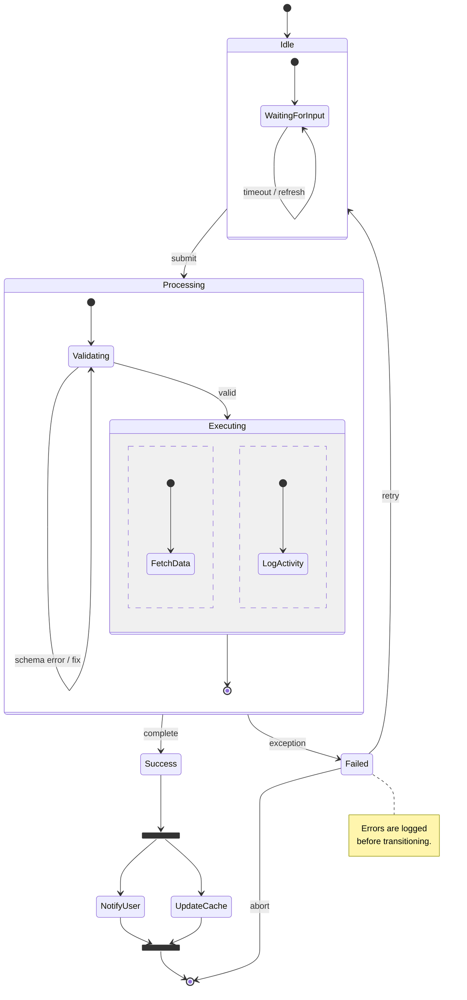

---

## 6. Gantt Chart

Keyword: `gantt`

### 6.1 Header Directives

```
gantt
    title  My Project Schedule
    dateFormat  YYYY-MM-DD
    axisFormat  %b %d
    excludes    weekends
    todayMarker on
```

**Common `dateFormat` tokens:**

| Token  | Meaning       |
|--------|---------------|
| `YYYY` | 4-digit year  |
| `MM`   | 2-digit month |
| `DD`   | 2-digit day   |

**`axisFormat` tokens (moment.js / d3):**

| Token | Meaning             |
|-------|---------------------|
| `%Y`  | 4-digit year        |
| `%m`  | 2-digit month       |
| `%d`  | 2-digit day         |
| `%b`  | Short month name    |
| `%H`  | 24-hour hour        |

### 6.2 Sections and Tasks

```
gantt
    dateFormat YYYY-MM-DD
    section Phase 1
        Task A : a1, 2024-01-01, 7d
        Task B : a2, after a1, 5d
```

Task syntax: `name : [modifiers,] [id,] start, duration`

- `start` can be a date string or `after <id>` for dependency.
- `duration` uses `d` (days), `h` (hours), `w` (weeks).

### 6.3 Task Modifiers / Status

| Modifier    | Meaning                            |
|-------------|------------------------------------|
| `done`      | Completed (grey)                   |
| `active`    | In progress (blue)                 |
| `crit`      | Critical path (red)                |
| `milestone` | Milestone marker (zero-length)     |

Modifiers can be combined: `done, crit` → completed critical task.

### 6.4 excludes

```
excludes weekends
excludes 2024-12-25, 2024-01-01
```

### 6.5 Complete Gantt Example

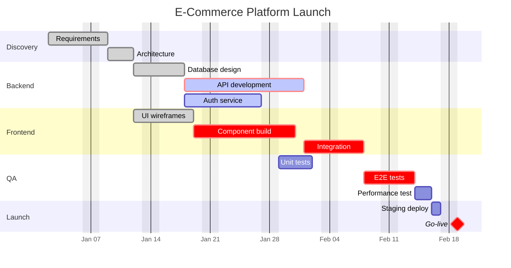

---

## 7. Mind Map

Keyword: `mindmap`
**Requires Mermaid v10.0+**

### 7.1 Syntax Rules

- Indentation determines hierarchy (spaces or tabs — must be consistent).
- The root node has zero indentation.
- Each level of indentation = one level deeper.
- No explicit connector syntax; structure is implicit.

### 7.2 Node Shapes

| Syntax            | Shape              |
|-------------------|--------------------|
| `Root`            | Default (rounded)  |
| `(Text)`          | Rounded / ellipse  |
| `[Text]`          | Rectangle / square |
| `((Text))`        | Circle             |
| `{{Text}}`        | Hexagon            |
| `)Text(`          | Cloud / bang shape |

### 7.3 Icons and Classes

```
mindmap
    Root
        ::icon(fa fa-book)
        A node with icon
        A::myClass
            Styled node
```

### 7.4 Complete Mind Map Example

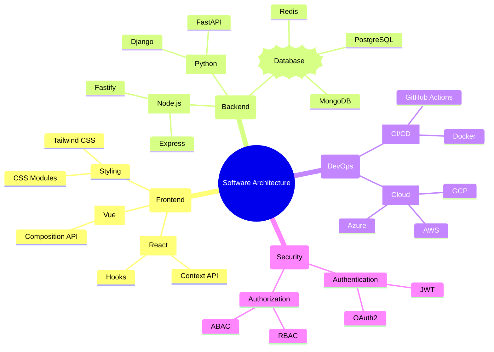

---

## 8. Architecture Diagram

Keyword: `architecture-beta`
**Requires Mermaid v11.0+**

### 8.1 Concepts

- **service** — a node in the diagram (has an icon and label).
- **group** — a named bounding box that contains services.
- **edges** — connect service ports with directional arrows.

### 8.2 Service Syntax

```
architecture-beta
    service serviceId(icon)[Label]
    service serviceId(icon)[Label] in groupId
```

### 8.3 Group Syntax

```
architecture-beta
    group groupId(icon)[Group Label]
    group nestedGroup(icon)[Nested] in parentGroup
```

### 8.4 Built-in Icons

| Icon token   | Represents        |
|--------------|-------------------|
| `cloud`      | Cloud / general   |
| `server`     | Server            |
| `database`   | Database          |
| `internet`   | Internet / globe  |
| `disk`       | Storage disk      |
| `queue`      | Message queue     |
| `function`   | Serverless fn     |
| `gateway`    | API gateway       |
| `shield`     | Security          |
| `user`       | End user          |
| `users`      | Group of users    |

> The icon set is based on Iconify. Any Iconify icon can be referenced as `iconify:icon-name` if bundled.

### 8.5 Edge Direction Ports

Each service has four ports: `L` (left), `R` (right), `T` (top), `B` (bottom).

Edge syntax:
```
serviceA{portA} --> portB{serviceB}
```

Example: `lb{loadBalancer}R --> L{api1}` — connects the right port of `loadBalancer` to the left port of `api1`.

### 8.6 Complete Architecture Diagram Example


---

## 9. Other Chart Types

### 9.1 Pie Chart

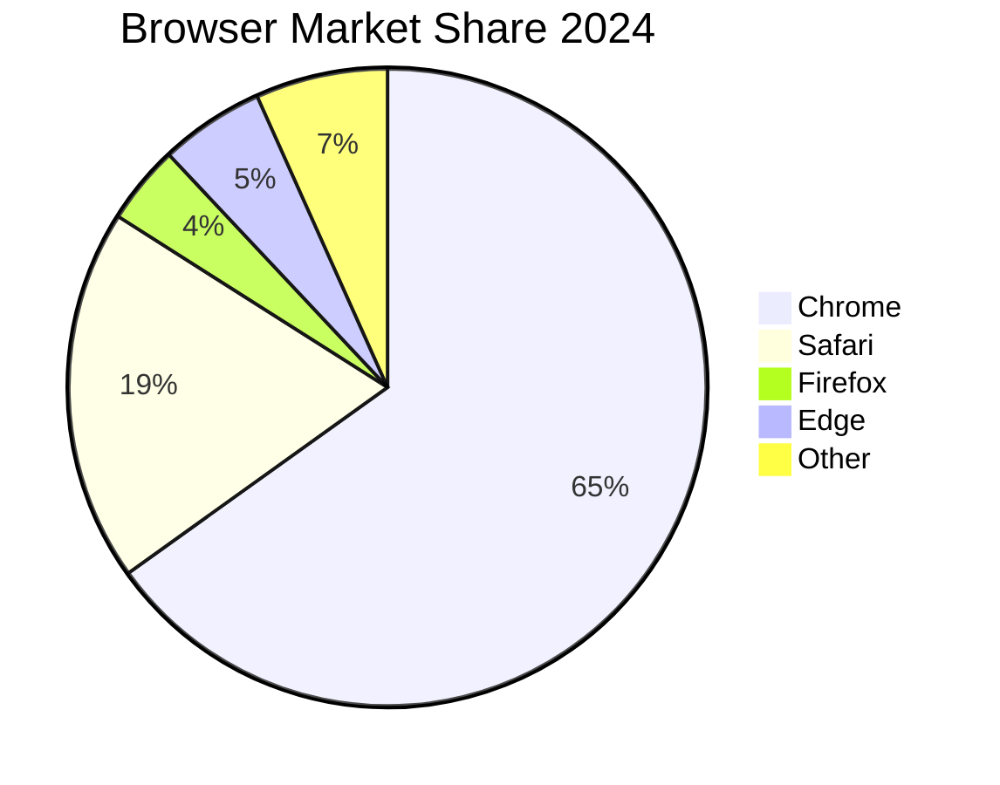

Optional: `showData` keyword after `pie` shows numeric values in the legend.

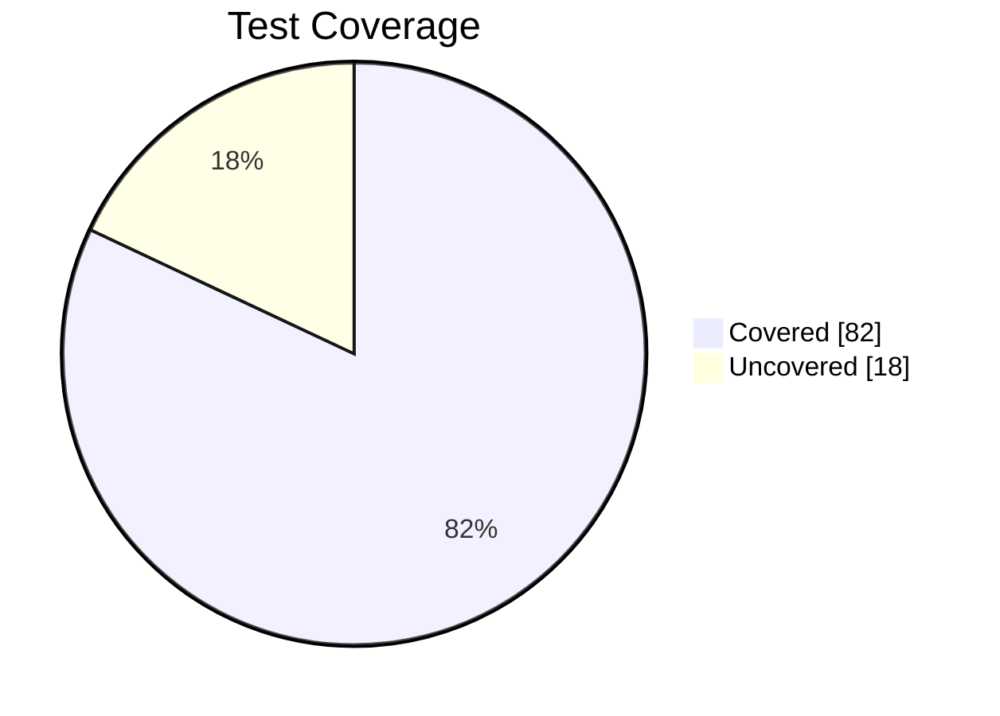

### 9.2 Quadrant Chart

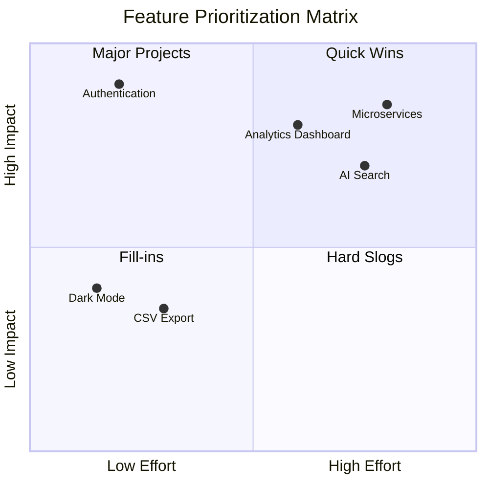

### 9.3 Timeline

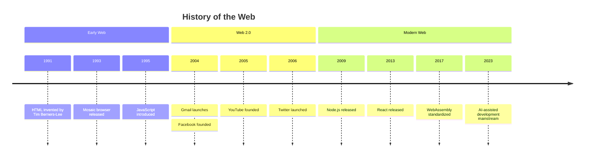

### 9.4 XY Chart (Bar / Line)

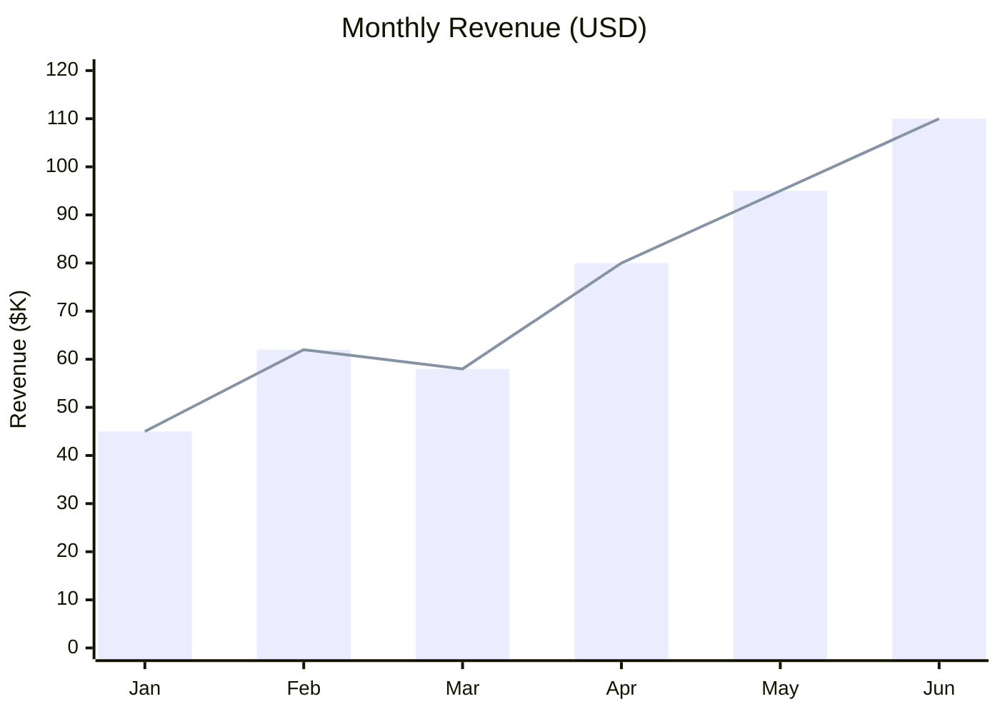

Multiple series with separate `bar` / `line` blocks are rendered together.
`xychart-beta` requires Mermaid v10.2+.

---

## 10. Theming & Styling

### 10.1 init Directive

Place an `%%{init: {...}}%%` comment at the top of the diagram:

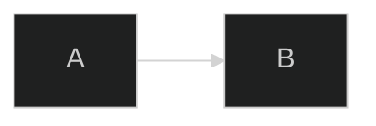

The directive must be on the **first line** of the diagram block.

### 10.2 Built-in Themes

| Theme name | Description                               |
|------------|-------------------------------------------|
| `default`  | Light theme with blue accents (default)   |
| `neutral`  | Greyscale, clean minimal look             |
| `dark`     | Dark background, suitable for dark UIs    |
| `forest`   | Green-toned theme                         |
| `base`     | Bare-bones; easiest to customize via `themeVariables` |

```mermaid
%%{init: {"theme": "forest"}}%%
flowchart TD
    A[Start] --> B[End]
```

### 10.3 themeVariables

Combine `themeVariables` with `"theme": "base"` for full control:

```mermaid
%%{init: {
  "theme": "base",
  "themeVariables": {
    "primaryColor":       "#4A90D9",
    "primaryBorderColor": "#2C5F8A",
    "primaryTextColor":   "#FFFFFF",
    "secondaryColor":     "#F0F4F8",
    "tertiaryColor":      "#E8F5E9",
    "background":         "#FAFAFA",
    "mainBkg":            "#4A90D9",
    "nodeBorder":         "#2C5F8A",
    "clusterBkg":         "#E3EEF9",
    "titleColor":         "#1A1A2E",
    "edgeLabelBackground":"#FFFFFF",
    "fontFamily":         "Inter, sans-serif",
    "fontSize":           "14px",
    "lineColor":          "#666666"
  }
}}%%
flowchart LR
    A[Styled Node] --> B[Another Node]
```

**Common `themeVariables` keys:**

| Variable              | Affects                                     |
|-----------------------|---------------------------------------------|
| `primaryColor`        | Main node fill color                        |
| `primaryBorderColor`  | Main node border color                      |
| `primaryTextColor`    | Text inside primary nodes                   |
| `secondaryColor`      | Secondary node fill                         |
| `tertiaryColor`       | Tertiary / subgraph fill                    |
| `background`          | Diagram background                          |
| `mainBkg`             | Default node background (flowchart)         |
| `nodeBorder`          | Default node border (flowchart)             |
| `clusterBkg`          | Subgraph / cluster background               |
| `titleColor`          | Title text color                            |
| `edgeLabelBackground` | Background of edge label boxes              |
| `fontFamily`          | Font for all text                           |
| `fontSize`            | Base font size                              |
| `lineColor`           | Edge / connector color                      |
| `actorBkg`            | Sequence diagram actor fill                 |
| `actorBorder`         | Sequence diagram actor border               |
| `activationBkgColor`  | Sequence diagram activation bar fill        |
| `loopTextColor`       | Sequence diagram loop label text            |
| `labelBoxBkgColor`    | Sequence diagram note / label box fill      |

### 10.4 Per-Node Inline Style

Apply CSS to a specific node ID using `style`:

```mermaid
flowchart LR
    A[Normal] --> B[Styled] --> C[Normal]
    style B fill:#FF6B6B,stroke:#C0392B,color:#fff,stroke-width:2px
```

Supported CSS properties: `fill`, `stroke`, `stroke-width`, `color`, `font-size`, `font-weight`, `rx` (border-radius).

### 10.5 classDef and :::className

Define a reusable class and apply it to multiple nodes:

```mermaid
flowchart TD
    classDef success fill:#27AE60,stroke:#1E8449,color:#fff
    classDef warning fill:#F39C12,stroke:#D68910,color:#fff
    classDef danger  fill:#E74C3C,stroke:#C0392B,color:#fff
    classDef neutral fill:#95A5A6,stroke:#717D7E,color:#fff

    A[Start]:::neutral --> B{Check}
    B -- pass --> C[OK]:::success
    B -- warn --> D[Review]:::warning
    B -- fail --> E[Error]:::danger
```

Apply `classDef` to a node with `:::className` appended to the node definition,
or use `class nodeId className` on a separate line:

```
class A,C success
```

**Default class** (applies to all nodes not otherwise styled):

```
classDef default fill:#EBF5FB,stroke:#2E86C1
```

### 10.6 Complete Theming Example

```mermaid
%%{init: {
  "theme": "base",
  "themeVariables": {
    "primaryColor":       "#1E3A5F",
    "primaryBorderColor": "#16304F",
    "primaryTextColor":   "#FFFFFF",
    "clusterBkg":         "#EBF5FB",
    "fontFamily":         "system-ui, sans-serif"
  }
}}%%
flowchart LR
    classDef db    fill:#2E86C1,stroke:#1A5276,color:#fff
    classDef cache fill:#1ABC9C,stroke:#148F77,color:#fff
    classDef ui    fill:#8E44AD,stroke:#6C3483,color:#fff

    subgraph Client
        FE[Frontend]:::ui
    end

    subgraph Services
        API[REST API]
        WS[WebSocket]
    end

    subgraph Storage
        DB[(PostgreSQL)]:::db
        RD[(Redis)]:::cache
    end

    FE --> API
    FE --> WS
    API --> DB
    API --> RD
    WS  --> RD

    style API fill:#E67E22,stroke:#CA6F1E,color:#fff
    style WS  fill:#E67E22,stroke:#CA6F1E,color:#fff
```

---

## 11. Common Pitfalls

### 11.1 Special Characters and Quotes

**Problem:** Labels containing `(`, `)`, `{`, `}`, `[`, `]`, `>`, `<`, `-`, `#`, `"`, `;` can break parsing.

**Fix:** Wrap labels in double quotes.

```mermaid
flowchart LR
    A["user.name (required)"] --> B["validate & save"]
    C["price > 0?"] --> D["cost: $10.00"]
```

In sequence diagrams, message labels with colons or special characters must also be quoted or escaped:

```
Alice->>Bob: "Hello: world!"
```

### 11.2 Subgraph ID vs Node ID Conflicts

**Problem:** If a subgraph and a node share the same ID, edges may connect to the wrong element.

**Rule:** Always use distinct IDs for subgraphs and nodes. Prefix subgraph IDs (e.g., `sg_backend`) to avoid collision.

```
%% BAD - "api" is both a subgraph and a node
subgraph api
    api[API Node]
end

%% GOOD
subgraph sg_api [API Layer]
    apiNode[API Node]
end
```

### 11.3 Version Gating

| Feature                  | Minimum Version |
|--------------------------|-----------------|
| `mindmap`                | v10.0           |
| `xychart-beta`           | v10.2           |
| `architecture-beta`      | v11.0           |
| `stateDiagram-v2`        | v8.0            |
| `quadrantChart`          | v10.0           |
| `timeline`               | v9.4            |
| `flowchart` (vs `graph`) | v8.0            |
| `classDiagram` generics  | v8.5            |

Before using `mindmap` or `architecture-beta`, verify the target environment's Mermaid version.

### 11.4 ERD Attribute Type Restrictions

- Types **must be a single word** (no whitespace, no parentheses).
- `varchar(255)` → use `string` instead.
- `timestamp with time zone` → use `datetime` instead.
- Attribute type values are cosmetic only; Mermaid does not validate them.

### 11.5 GitHub Rendering and Semicolons

**Problem:** GitHub's Mermaid renderer (via its Markdown pipeline) can be stricter than the standalone library.

**Rules for GitHub:**
- Do **not** terminate lines with `;` inside diagram blocks — semicolons confuse the GitHub parser.
- Avoid multi-statement lines.
- Keep the opening ` ```mermaid ` fence on its own line with no trailing content.

### 11.6 Sequence Diagram Participant Names with Spaces

**Problem:** Participant names with spaces break arrow syntax.

**Fix:** Declare participants with an alias:

```
%% BAD
API Gateway->>Auth Service: validate

%% GOOD
participant GW as API Gateway
participant AS as Auth Service
GW->>AS: validate
```

### 11.7 Flowchart Label Escaping in Different Contexts

When rendered inside HTML (e.g., in a `<div>` with the Mermaid JS library), HTML entities like `&amp;`, `&lt;` may be needed. In Markdown fenced code blocks, use literal characters inside quotes:

```mermaid
flowchart LR
    A["price >= 0 && stock > 0"] --> B[Available]
```

### 11.8 Things Mermaid Does NOT Support (Do Not Attempt)

- **Inline images or icons inside nodes** — not supported natively (only `architecture-beta` has icon support).
- **Hyperlinks on edges** — only nodes support `click` callbacks / hyperlinks.
- **Custom arrow colors per edge** — per-edge styling is not available; use `classDef` on nodes instead.
- **Multi-root flowcharts from two separate `flowchart` blocks** — each code block is a separate diagram.
- **Mathematical / LaTeX notation** — not rendered by Mermaid.
- **Tables or lists inside nodes** — node labels are plain text (or basic HTML in some renderers).
- **Auto-wrapping long labels** — long labels must use `<br/>` (in HTML mode) or `\n` (limited support) manually.
- **Z-ordering / layering control** — Mermaid controls layout automatically via Dagre/ELK.
- **Conditional rendering / scripting** — Mermaid is purely declarative; no conditionals or variables.

### 11.9 Node ID Restrictions

- Node IDs should not contain spaces or special characters.
- Use camelCase or underscores: `myNode`, `my_node`.
- Do not start a node ID with a digit: use `n1` not `1n`.
- Reserved words (`end`, `graph`, `subgraph`, `classDef`, etc.) should not be used as node IDs.

### 11.10 ER Diagram Relationship Label Requirement

Every ER relationship **must** have a label (the part after `:`). If no semantic label is desired, use an empty string:

```
CUSTOMER ||--o{ ORDER : ""
```

Omitting the label entirely causes a parse error.

### 11.11 Gantt Date Parsing Sensitivity

- The `dateFormat` **must** match every date string used in task definitions exactly.
- `dateFormat YYYY-MM-DD` expects `2024-01-15`, not `01/15/2024`.
- The `after <id>` keyword requires the referenced task ID to be defined **before** the dependent task.

---

*This reference covers Mermaid syntax as of v11.x. Always check the [official Mermaid documentation](https://mermaid.js.org/intro/) for the latest additions.*
